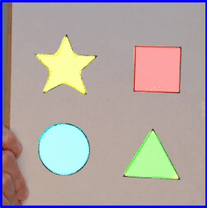
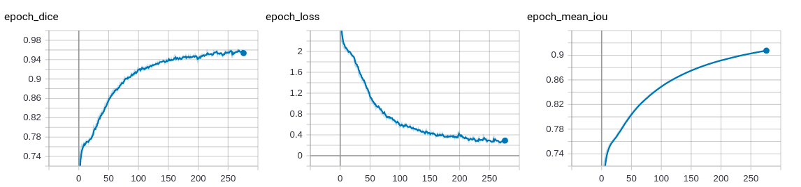
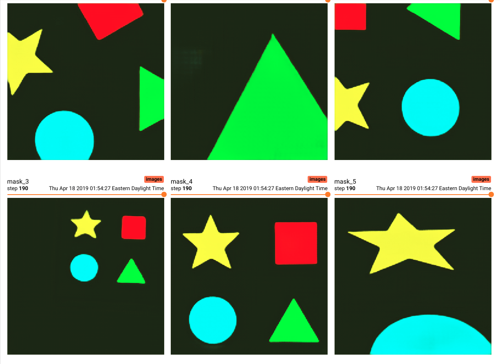
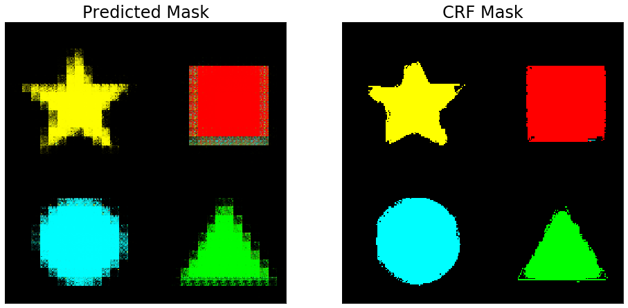

# Semantic Shapes: Custom Semantic Segmentation Tutorial/ Pipeline



This repository provides a pipeline to develop different semantic segmentation models.

U-Net and FCN-8 are supported.

## Install

Make sure you have a working versions of CUDA, cudnn, and nvidia drivers.

I currently use cuda 10.0 with nvidia-driver-418

### Ubuntu 18.04

You can see your nvidia driver using `nvidia-smi`

Check your cuda version with `nvcc -V`

```
conda create -n shapes python=3.7
source activate shapes
pip install -r requirements.txt
```

I had some trouble installing pygame on ubuntu 18.04.
I was able to install pygame using:

1. open sources.list
`sudo nano /etc/apt/sources.list`
2. add this line at the bottom on sources.list
`deb http://archive.ubuntu.com/ubuntu/ cosmic-proposed universe`
3. update the list of available software
`sudo apt update`
`sudo apt install python3-pygame`

pydensecrf is used for conditional random field post processing.

`pip install git+https://github.com/lucasb-eyer/pydensecrf.git`

### Windows 10

The current eigen library in pydensecrf will cause pip to fail on windows.
Work around involves installing via conda.

```
conda create -n shapes python=3.6
activate shapes
conda install -c conda-forge pydensecrf
```

2-6-20
Shapely should now install with 1.7 in python 3.6 on pip.

`pip install -r windows_requirements.txt`

## Collection

**Change imshape in config.py and try importing the models before collecting images**

I used a shape of (256, 256, 3), but make sure before you collect your images\
to make sure they fit with the model you want to use.

Images for FCN-8 should have a shape with a multiple of 32. (in order to be upsampled 32 times)

`python collect.py`

Starts a thread for a webcam (utils.py) as device 0. Press S to save images to the images directory.

## Annotation

Images should be annotated in labelme and output to a separate directory (annotated).
Do not worry about labeling color. The only thing that matters is the polygon class label.

**do not annotate background**

You should only annotate regions of interest with polygons.
If an image is all background, just skip to the next image.
generate_missing_json in utils.py will be called before training if annotations are missing.
It assumes these missing files are all background.
json files will be generated to annotate pure background for those missing annotations.

## Training

config.py will have all the settings you want to change.

1. imshape: (width, height, n_channels)
2. mode: 'binary' or 'multi'
3. model_name: string to name your model's save file
4. logbase: directory for tensorboard. usually: 'logs'
5. hues: dictionary to set hues for each label from json files

`python train.py`

## Tensorboard

Once the model is training, view tensorboard using:

`tensorboard --logdir=logs`




## Stream

Stream will use whatever model_name is set in config.py

`python stream.py`

B - Toggle Background

C - Toggle CRF

M - Softmax vs Argmax Mode

## Conditional Random Fields

Conditional random fields may produce an improved mask.


